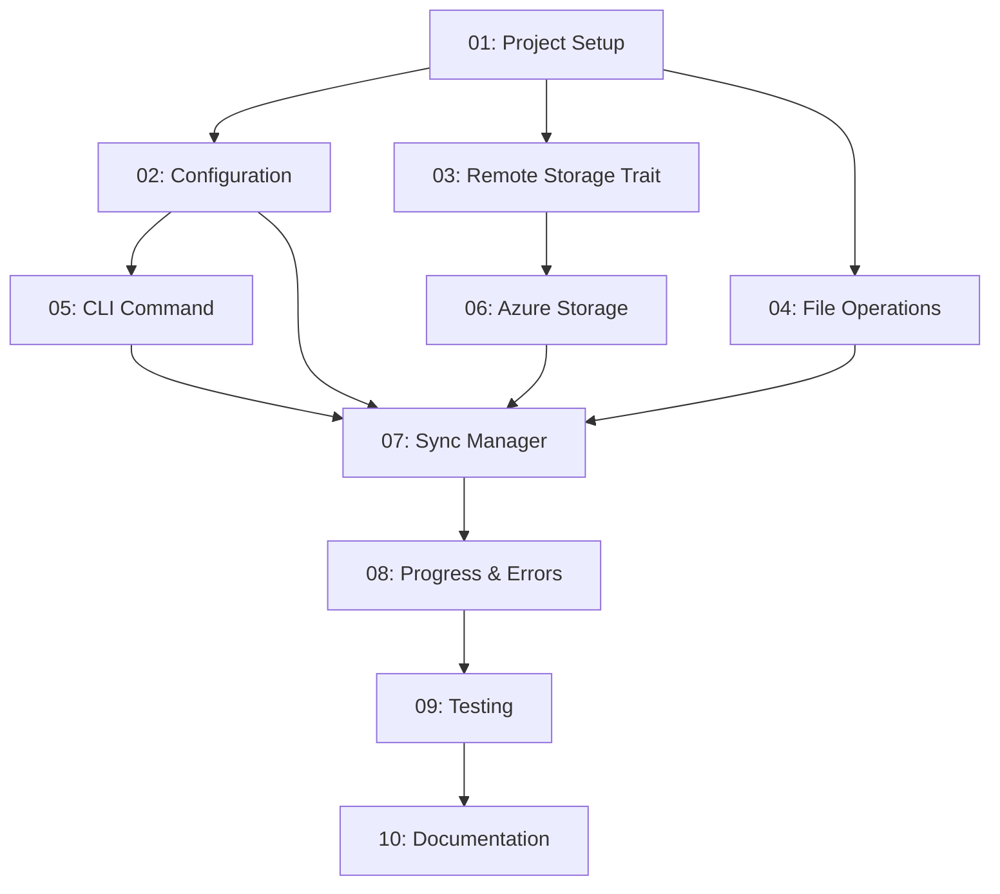

# Push Command Implementation - Task Overview

This folder contains a step-by-step breakdown of implementing the `devlog push` command as specified in the push-command-requirements.md. Each task is designed to be completed independently while building towards the complete feature.

## Task Sequence

The tasks are designed to be completed in order, with each task building upon the previous ones:

1. **[Task 01: Project Setup](./01-project-setup.md)** - Add necessary dependencies and basic project structure
2. **[Task 02: Configuration System](./02-configuration-system.md)** - Implement TOML-based configuration management
3. **[Task 03: Remote Storage Trait](./03-remote-storage-trait.md)** - Define the cloud-agnostic storage interface
4. **[Task 04: File Operations](./04-file-operations.md)** - Implement file scanning, hashing, and local utilities
5. **[Task 05: CLI Command Structure](./05-cli-command-structure.md)** - Add the push command to the CLI interface
6. **[Task 06: Azure Storage Client](./06-azure-storage-client.md)** - Implement Azure Blob Storage integration
7. **[Task 07: Sync Manager](./07-sync-manager.md)** - Implement the core synchronization logic
8. **[Task 08: Progress & Error Handling](./08-progress-error-handling.md)** - Add user feedback and robust error handling
9. **[Task 09: Testing & Validation](./09-testing-validation.md)** - Comprehensive testing and edge case handling
10. **[Task 10: Documentation & Polish](./10-documentation-polish.md)** - Final documentation and user experience improvements

## Success Criteria

Upon completion of all tasks, the implementation should meet the MVP requirements:

- ✅ User can configure Azure storage in `~/.devlog/config.toml`
- ✅ `devlog push` performs incremental uploads (default behavior)
- ✅ `devlog push --mode all` uploads all files
- ✅ Clear progress indication during uploads
- ✅ Meaningful error messages for common failure scenarios
- ✅ Backwards compatibility with existing local functionality

## Time Estimation

- **Beginner Rust Developer**: 3-4 weeks (following tasks sequentially)
- **Experienced Rust Developer**: 1-2 weeks
- **Each Individual Task**: 2-6 hours depending on complexity

## Getting Help

Since you're new to Rust but experienced with Azure:
- Focus on understanding Rust concepts in tasks 1-3
- Azure-specific implementation in task 6 should feel familiar
- Ask for help with Rust-specific patterns (traits, error handling, async/await)
- Test frequently as you complete each task

## Dependencies Between Tasks

Start with Task 01 and work sequentially through the tasks for the best learning experience.
