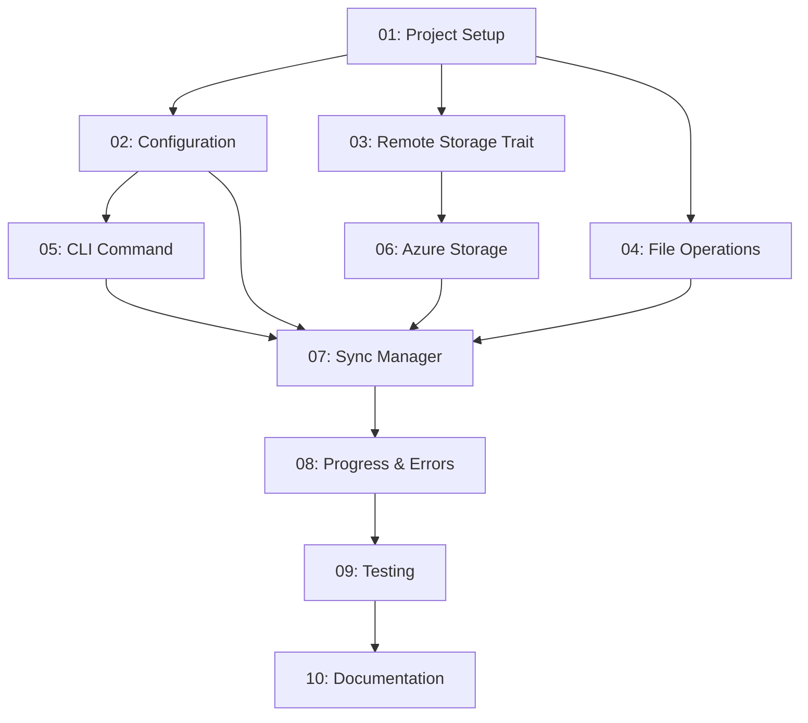

# Push Command Implementation - Task Overview

This folder contains a step-by-step breakdown of implementing the `devlog push` command as specified in the push-command-requirements.md. Each task is designed to be completed independently while building towards the complete feature.

## Implementation Roadmap

This directory contains a step-by-step breakdown of implementing the push command feature. Each task builds upon the previous ones and includes detailed learning notes for developers new to Rust.

### Phase 1: Foundation (Tasks 01-04) ✅

- **Task 01**: Project Setup & Dependencies - _Completed_
- **Task 02**: Configuration System - _Completed_
- **Task 03**: Remote Storage Trait & Azure Implementation - _Completed_
- **Task 04**: File Operations & Local Storage - _Completed_

### Phase 2: Core Implementation (Tasks 05-07) ✅

- **Task 05**: CLI Command Structure & Integration - _Completed_
- **Task 06**: Azure Storage Client Implementation - _Completed_
- **Task 07**: Sync Manager & Upload Orchestration - _Completed_

### Phase 3: User Experience (Tasks 08-10) ✅

- **Task 08**: Progress Reporting & Error Handling - _Completed_
- **Task 09**: Testing & Validation - _Completed_
- **Task 10**: Documentation & Polish - _Completed_

## Success Criteria

Upon completion of all tasks, the implementation should meet the MVP requirements:

- ✅ User can configure Azure storage in `~/.devlog/config.toml`
- ✅ `devlog push` performs incremental uploads (default behavior)
- ✅ `devlog push --mode all` uploads all files
- ✅ Clear progress indication during uploads
- ✅ Meaningful error messages for common failure scenarios
- ✅ Backwards compatibility with existing local functionality

## Time Estimation

- **Beginner Rust Developer**: 3-4 weeks (following tasks sequentially)
- **Experienced Rust Developer**: 1-2 weeks
- **Each Individual Task**: 2-6 hours depending on complexity

## Getting Help

Since you're new to Rust but experienced with Azure:

- Focus on understanding Rust concepts in tasks 1-3
- Azure-specific implementation in task 6 should feel familiar
- Ask for help with Rust-specific patterns (traits, error handling, async/await)
- Test frequently as you complete each task

## Dependencies Between Tasks

Start with Task 01 and work sequentially through the tasks for the best learning experience.
